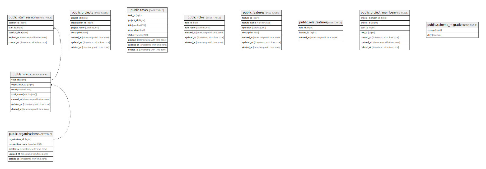

# project_db

## Tables

| Name | Columns | Comment | Type |
| ---- | ------- | ------- | ---- |
| [public.organizations](public.organizations.md) | 5 |  | BASE TABLE |
| [public.staffs](public.staffs.md) | 7 |  | BASE TABLE |
| [public.staff_sessions](public.staff_sessions.md) | 5 |  | BASE TABLE |
| [public.projects](public.projects.md) | 7 |  | BASE TABLE |
| [public.tasks](public.tasks.md) | 8 |  | BASE TABLE |
| [public.roles](public.roles.md) | 5 |  | BASE TABLE |
| [public.features](public.features.md) | 7 |  | BASE TABLE |
| [public.role_features](public.role_features.md) | 3 |  | BASE TABLE |
| [public.project_members](public.project_members.md) | 7 |  | BASE TABLE |
| [public.schema_migrations](public.schema_migrations.md) | 2 |  | BASE TABLE |

## Relations

---

> Generated by [tbls](https://github.com/k1LoW/tbls)
