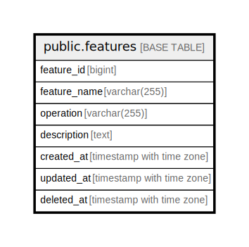

# public.features

## Description

## Columns

| Name         | Type                     | Default                                      | Nullable | Children | Parents | Comment |
| ------------ | ------------------------ | -------------------------------------------- | -------- | -------- | ------- | ------- |
| feature_id   | bigint                   | nextval('features_feature_id_seq'::regclass) | false    |          |         |         |
| feature_name | varchar(255)             |                                              | false    |          |         |         |
| operation    | varchar(255)             |                                              | false    |          |         |         |
| description  | text                     |                                              | true     |          |         |         |
| created_at   | timestamp with time zone | CURRENT_TIMESTAMP                            | false    |          |         |         |
| updated_at   | timestamp with time zone | CURRENT_TIMESTAMP                            | false    |          |         |         |
| deleted_at   | timestamp with time zone |                                              | true     |          |         |         |

## Constraints

| Name          | Type        | Definition               |
| ------------- | ----------- | ------------------------ |
| features_pkey | PRIMARY KEY | PRIMARY KEY (feature_id) |

## Indexes

| Name          | Definition                                                                    |
| ------------- | ----------------------------------------------------------------------------- |
| features_pkey | CREATE UNIQUE INDEX features_pkey ON public.features USING btree (feature_id) |

## Relations

---

> Generated by [tbls](https://github.com/k1LoW/tbls)
