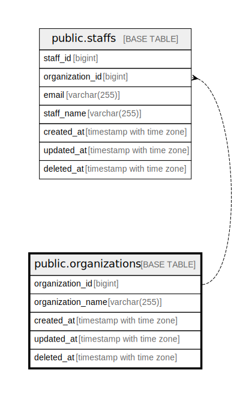

# public.organizations

## Description

## Columns

| Name              | Type                     | Default                                                | Nullable | Children                          | Parents | Comment |
| ----------------- | ------------------------ | ------------------------------------------------------ | -------- | --------------------------------- | ------- | ------- |
| organization_id   | bigint                   | nextval('organizations_organization_id_seq'::regclass) | false    | [public.staffs](public.staffs.md) |         |         |
| organization_name | varchar(255)             |                                                        | false    |                                   |         |         |
| created_at        | timestamp with time zone | CURRENT_TIMESTAMP                                      | false    |                                   |         |         |
| updated_at        | timestamp with time zone | CURRENT_TIMESTAMP                                      | false    |                                   |         |         |
| deleted_at        | timestamp with time zone |                                                        | true     |                                   |         |         |

## Constraints

| Name               | Type        | Definition                    |
| ------------------ | ----------- | ----------------------------- |
| organizations_pkey | PRIMARY KEY | PRIMARY KEY (organization_id) |

## Indexes

| Name               | Definition                                                                                   |
| ------------------ | -------------------------------------------------------------------------------------------- |
| organizations_pkey | CREATE UNIQUE INDEX organizations_pkey ON public.organizations USING btree (organization_id) |

## Relations

---

> Generated by [tbls](https://github.com/k1LoW/tbls)
