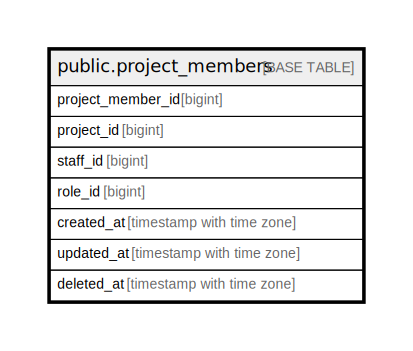

# public.project_members

## Description

## Columns

| Name | Type | Default | Nullable | Children | Parents | Comment |
| ---- | ---- | ------- | -------- | -------- | ------- | ------- |
| project_member_id | bigint | nextval('project_members_project_member_id_seq'::regclass) | false |  |  |  |
| project_id | bigint |  | false |  |  |  |
| staff_id | bigint |  | false |  |  |  |
| role_id | bigint |  | false |  |  |  |
| created_at | timestamp with time zone | CURRENT_TIMESTAMP | false |  |  |  |
| updated_at | timestamp with time zone | CURRENT_TIMESTAMP | false |  |  |  |
| deleted_at | timestamp with time zone |  | true |  |  |  |

## Constraints

| Name | Type | Definition |
| ---- | ---- | ---------- |
| project_members_pkey | PRIMARY KEY | PRIMARY KEY (project_member_id) |
| idx_project_staff | UNIQUE | UNIQUE (project_id, staff_id) |

## Indexes

| Name | Definition |
| ---- | ---------- |
| project_members_pkey | CREATE UNIQUE INDEX project_members_pkey ON public.project_members USING btree (project_member_id) |
| idx_project_staff | CREATE UNIQUE INDEX idx_project_staff ON public.project_members USING btree (project_id, staff_id) |

## Relations

---

> Generated by [tbls](https://github.com/k1LoW/tbls)
