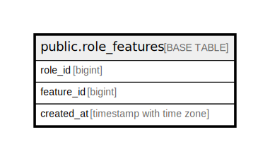

# public.role_features

## Description

## Columns

| Name | Type | Default | Nullable | Children | Parents | Comment |
| ---- | ---- | ------- | -------- | -------- | ------- | ------- |
| role_id | bigint |  | false |  |  |  |
| feature_id | bigint |  | false |  |  |  |
| created_at | timestamp with time zone | CURRENT_TIMESTAMP | false |  |  |  |

## Constraints

| Name | Type | Definition |
| ---- | ---- | ---------- |
| role_features_pkey | PRIMARY KEY | PRIMARY KEY (role_id, feature_id) |

## Indexes

| Name | Definition |
| ---- | ---------- |
| role_features_pkey | CREATE UNIQUE INDEX role_features_pkey ON public.role_features USING btree (role_id, feature_id) |

## Relations

---

> Generated by [tbls](https://github.com/k1LoW/tbls)
