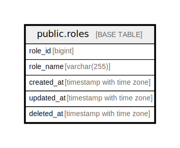

# public.roles

## Description

## Columns

| Name       | Type                     | Default                                | Nullable | Children | Parents | Comment |
| ---------- | ------------------------ | -------------------------------------- | -------- | -------- | ------- | ------- |
| role_id    | bigint                   | nextval('roles_role_id_seq'::regclass) | false    |          |         |         |
| role_name  | varchar(255)             |                                        | false    |          |         |         |
| created_at | timestamp with time zone | CURRENT_TIMESTAMP                      | false    |          |         |         |
| updated_at | timestamp with time zone | CURRENT_TIMESTAMP                      | false    |          |         |         |
| deleted_at | timestamp with time zone |                                        | true     |          |         |         |

## Constraints

| Name       | Type        | Definition            |
| ---------- | ----------- | --------------------- |
| roles_pkey | PRIMARY KEY | PRIMARY KEY (role_id) |

## Indexes

| Name       | Definition                                                           |
| ---------- | -------------------------------------------------------------------- |
| roles_pkey | CREATE UNIQUE INDEX roles_pkey ON public.roles USING btree (role_id) |

## Relations

---

> Generated by [tbls](https://github.com/k1LoW/tbls)
