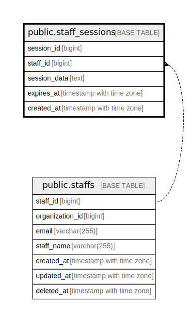

# public.staff_sessions

## Description

## Columns

| Name | Type | Default | Nullable | Children | Parents | Comment |
| ---- | ---- | ------- | -------- | -------- | ------- | ------- |
| session_id | bigint | nextval('staff_sessions_session_id_seq'::regclass) | false |  |  |  |
| staff_id | bigint |  | false |  |  |  |
| session_data | text |  | true |  |  |  |
| expires_at | timestamp with time zone |  | false |  |  |  |
| created_at | timestamp with time zone | CURRENT_TIMESTAMP | false |  |  |  |

## Constraints

| Name | Type | Definition |
| ---- | ---- | ---------- |
| staff_sessions_pkey | PRIMARY KEY | PRIMARY KEY (session_id) |

## Indexes

| Name | Definition |
| ---- | ---------- |
| staff_sessions_pkey | CREATE UNIQUE INDEX staff_sessions_pkey ON public.staff_sessions USING btree (session_id) |

## Relations

---

> Generated by [tbls](https://github.com/k1LoW/tbls)
