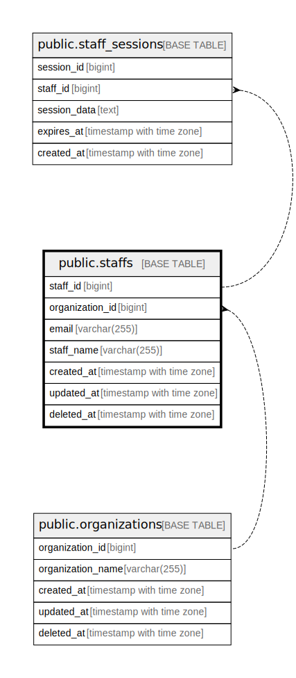

# public.staffs

## Description

## Columns

| Name | Type | Default | Nullable | Children | Parents | Comment |
| ---- | ---- | ------- | -------- | -------- | ------- | ------- |
| staff_id | bigint | nextval('staffs_staff_id_seq'::regclass) | false |  |  |  |
| organization_id | bigint |  | false |  |  |  |
| email | varchar(255) |  | false |  |  |  |
| staff_name | varchar(255) |  | false |  |  |  |
| created_at | timestamp with time zone | CURRENT_TIMESTAMP | false |  |  |  |
| updated_at | timestamp with time zone | CURRENT_TIMESTAMP | false |  |  |  |
| deleted_at | timestamp with time zone |  | true |  |  |  |

## Constraints

| Name | Type | Definition |
| ---- | ---- | ---------- |
| staffs_pkey | PRIMARY KEY | PRIMARY KEY (staff_id) |
| idx_org_email | UNIQUE | UNIQUE (organization_id, email) |

## Indexes

| Name | Definition |
| ---- | ---------- |
| staffs_pkey | CREATE UNIQUE INDEX staffs_pkey ON public.staffs USING btree (staff_id) |
| idx_org_email | CREATE UNIQUE INDEX idx_org_email ON public.staffs USING btree (organization_id, email) |

## Relations

---

> Generated by [tbls](https://github.com/k1LoW/tbls)
