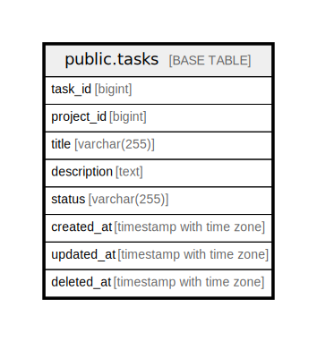

# public.tasks

## Description

## Columns

| Name        | Type                     | Default                                | Nullable | Children | Parents | Comment |
| ----------- | ------------------------ | -------------------------------------- | -------- | -------- | ------- | ------- |
| task_id     | bigint                   | nextval('tasks_task_id_seq'::regclass) | false    |          |         |         |
| project_id  | bigint                   |                                        | false    |          |         |         |
| title       | varchar(255)             |                                        | false    |          |         |         |
| description | text                     |                                        | true     |          |         |         |
| status      | varchar(255)             |                                        | false    |          |         |         |
| created_at  | timestamp with time zone | CURRENT_TIMESTAMP                      | false    |          |         |         |
| updated_at  | timestamp with time zone | CURRENT_TIMESTAMP                      | false    |          |         |         |
| deleted_at  | timestamp with time zone |                                        | true     |          |         |         |

## Constraints

| Name       | Type        | Definition            |
| ---------- | ----------- | --------------------- |
| tasks_pkey | PRIMARY KEY | PRIMARY KEY (task_id) |

## Indexes

| Name       | Definition                                                           |
| ---------- | -------------------------------------------------------------------- |
| tasks_pkey | CREATE UNIQUE INDEX tasks_pkey ON public.tasks USING btree (task_id) |

## Relations

---

> Generated by [tbls](https://github.com/k1LoW/tbls)
